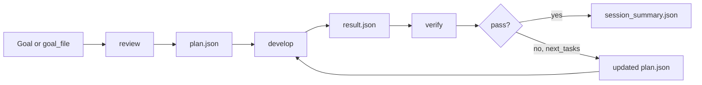

# aicoding-dual-pipeline

[English](README.md) | [中文](README.zh.md)

`aicoding-dual-pipeline` is a local-first Codex orchestrator for turning a single large AI coding request into a structured multi-stage workflow that is easier to review, verify, and integrate.

The project is positioned as `MCP + optional Skill`:

- `MCP` is the primary product surface for tool integration
- `Skill` is an optional guidance layer for agents that support skills or prompt packs

## At a Glance

- split AI coding work into explicit planning, execution, and verification stages
- expose that workflow as an MCP toolset for external AI coding assistants
- keep structured JSON artifacts for inspection, retry logic, and orchestration

## Workflow



## Who Is This For

- teams building local-first AI coding tools that need a callable execution pipeline
- agent builders who want reviewer/developer/verifier separation instead of one free-form prompt
- workflows that need persistent machine-readable artifacts for auditing or retries
- integrations that want MCP first, with an optional Skill on top

## Who Is This Not For

- users looking for a chat-first coding assistant UI
- workflows that only need a single prompt and do not benefit from structured handoff
- hosted SaaS orchestration out of the box; this repository is local-first
- users who do not want artifact files, schemas, or explicit stage boundaries

## Quick Start

Install and run the full three-stage workflow against a local Git repository:

```bash
cd /path/to/aicoding-dual-pipeline
python3 -m venv .venv
source .venv/bin/activate
python3 -m pip install -e .

aicoding-dual-pipeline \
  --repo /path/to/repo \
  --goal "Fix session expiration handling and add regression coverage" \
  run
```

If you want to integrate it into another agent, start here:

- [docs/mcp.md](docs/mcp.md)
- [docs/skill.md](docs/skill.md)
- [skill/SKILL.md](skill/SKILL.md)

## Why This Exists

Many real engineering tasks are not solved well by a single prompt. A more reliable pattern is:

1. inspect the repository and narrow the task
2. produce a structured implementation plan
3. execute against that plan
4. verify the result independently
5. if needed, issue the next small batch of work

This repository packages that pattern into a scriptable local tool that can also be exposed through MCP.

## Key Features

- fixed `review` / `develop` / `verify` stages
- `loop` mode that runs until success, blockage, or budget exhaustion
- JSON artifacts for planning, execution, verification, and session summaries
- JSON Schema-constrained outputs for tighter structure
- direct CLI usage for scripts and local automation
- MCP server support for integration into external AI coding tools
- background run mode with polling and log tailing
- optional Skill for better orchestration guidance in supported agent systems

## Product Model

Recommended usage:

- if you are integrating this into another tool, use the MCP interface first
- if your host agent supports skills, install the optional Skill on top

Responsibilities:

- MCP provides executable capabilities
- Skill provides calling strategy

Core constraints:

- the Reviewer does not edit code
- the Developer does not redefine the task plan unless blocked
- handoff happens through structured JSON artifacts

## Requirements

- a working `codex` CLI installation
- an authenticated Codex session
- Python `>=3.11`
- a local Git repository as the target
- `OPENAI_API_KEY` if you want to use the Agents SDK workflow

## Installation

```bash
cd /path/to/aicoding-dual-pipeline
python3 -m venv .venv
source .venv/bin/activate
python3 -m pip install -e .
```

If you prefer module execution instead of installed commands:

```bash
cd /path/to/aicoding-dual-pipeline
python3 -m dual_pipeline.cli --repo /path/to/repo --goal "Fix session expiration handling" run
```

Agents SDK + Codex MCP variant:

```bash
cd /path/to/aicoding-dual-pipeline
python3 -m venv .venv
source .venv/bin/activate
python3 -m pip install -e .
export OPENAI_API_KEY=...
python3 -m dual_pipeline.agents_sdk_cli --repo /path/to/repo --goal "Fix session expiration handling" run
```

Expose the pipeline as an MCP server:

```bash
cd /path/to/aicoding-dual-pipeline
source .venv/bin/activate
codex mcp add dual-pipeline -- /path/to/aicoding-dual-pipeline/.venv/bin/python -m dual_pipeline.mcp_server
```

## CLI Usage

Run only the planning stage:

```bash
aicoding-dual-pipeline \
  --repo /path/to/repo \
  --goal "Fix session expiration handling" \
  review
```

Run the full three-stage sequence:

```bash
aicoding-dual-pipeline \
  --repo /path/to/repo \
  --goal "Fix session expiration handling" \
  run
```

Run the iterative reviewer/developer loop:

```bash
python3 -m dual_pipeline.cli \
  --repo /path/to/repo \
  --goal-file /path/to/brief.md \
  loop
```

If `--max-iterations` is not provided, the tool asks an inner read-only Codex run to estimate a loop budget from the task brief and current repo state.

Run against a base branch:

```bash
aicoding-dual-pipeline \
  --repo /path/to/repo \
  --goal "Add 401 refresh retry tests" \
  --base origin/main \
  run
```

Preview the generated `codex exec` commands without executing them:

```bash
aicoding-dual-pipeline \
  --repo /path/to/repo \
  --goal "Fix session expiration handling" \
  --dry-run \
  run
```

## Artifacts

By default, artifacts are written under `artifacts/`:

- `plan.json`
- `result.json`
- `verdict.json`
- `session_summary.json`

## Implementation Variants

`dual_pipeline.cli`

- uses `codex exec` directly
- best for scripting, CI, and batch execution
- does not require `OPENAI_API_KEY`
- supports `loop`

`dual_pipeline.agents_sdk_cli`

- orchestrates specialized agents with the Agents SDK
- each agent talks to Codex through `codex mcp-server`
- closer to a longer-term multi-agent architecture
- requires `OPENAI_API_KEY`

## Design Notes

- `review` and `verify` run with `codex exec --sandbox read-only`
- `develop` runs with `codex exec --sandbox workspace-write`
- every stage uses `--output-schema` to constrain the final output
- context is built from Git state, diff summaries, recent commits, and prior JSON artifacts
- `loop` works like this:
  - first `review` creates the initial plan
  - then the tool repeats `develop -> verify`
  - if `verify` emits `next_tasks`, they are written back into a new `plan.json`
  - the loop ends on `pass`, `blocked`, no remaining follow-up tasks, or `--max-iterations`

## Recommended Integration Pattern

Use this repository as an intermediate coordinator that an outer Codex or AI coding agent can call:

1. the outer agent receives a large task or diagnosis
2. it calls:

```bash
python3 -m dual_pipeline.cli \
  --repo /path/to/repo \
  --goal-file /path/to/brief.md \
  --max-iterations 8 \
  loop
```

3. the inner pipeline handles:
   - Reviewer / Planner creates the first batch
   - Developer / Executor implements it
   - Reviewer / Verifier checks the result and issues the next batch
   - the process repeats until complete
4. the outer agent reads `artifacts/session_summary.json` and `verdict.json`, then decides what to report back to the user

## MCP Usage

Once registered, an outer agent can call these tools directly:

- `pipeline_loop`
- `start_pipeline_run`
- `get_pipeline_run`
- `tail_pipeline_log`
- `read_pipeline_artifact`

Typical call input:

```json
{
  "repo": "/path/to/repo",
  "goal_file": "docs/task-brief.md"
}
```

`goal_file` is recommended when possible:

- it must be inside the target repo
- it may be relative to the repo root
- it is the best way for an outer agent to point to an existing task brief in the repository

Only use inline `goal` when no such file exists.

`max_iterations` is optional:

- if omitted, the inner Codex run estimates it and adds one extra loop of slack
- if provided, your explicit value is used instead

`pipeline_loop` returns:

- `artifacts_dir`
- `session_summary`
- `plan_path`
- `result_path`
- `verdict_path`
- `stdout`

For tasks that may exceed synchronous call limits, prefer background mode:

1. `start_pipeline_run`
2. poll with `get_pipeline_run`
3. inspect progress with `tail_pipeline_log`
4. read artifacts with `read_pipeline_artifact`

Recommended long-task input:

```json
{
  "repo": "/path/to/repo",
  "goal_file": "docs/task-brief.md"
}
```

`start_pipeline_run` returns immediately with:

- `run_id`
- `status`
- `artifacts_dir`
- `log_path`
- `run_metadata_path`

Poll with:

```json
{
  "run_id": "your-run-id"
}
```

Tail recent logs with:

```json
{
  "run_id": "your-run-id",
  "max_lines": 80
}
```

Read a specific artifact with:

```json
{
  "artifacts_dir": "/path/to/artifacts-dir",
  "name": "verdict"
}
```

## Open Source Hygiene

If you publish the repository, do not commit:

- historical `runs/` logs and metadata
- generated `artifacts/`
- `*.egg-info/`, `__pycache__/`, `.DS_Store`
- any example output containing real local paths, repo names, or task contents

## License

MIT. See [LICENSE](LICENSE).

## Future Directions

If you want to evolve this into a more conversational long-lived multi-session system, a reasonable next step is:

1. keep the current JSON handoff schemas stable
2. extract `review` / `develop` / `verify` prompts into dedicated template files
3. preserve long-lived thread identifiers for Reviewer, Developer, and Verifier separately
4. add orchestrator-level handoff tracing and visualization
